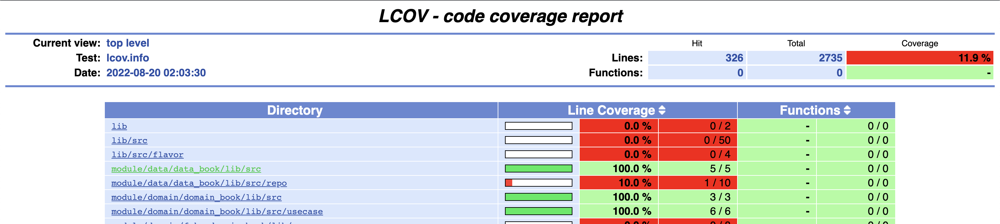

# Goat Flutter Challenge

XYZ Goat Flutter Challenge - Scenario B

Implement with `clean architecture` and multiple repo in mind, 
so that it can be scallable to be re-used in different apps

## Demo

https://user-images.githubusercontent.com/9499570/185303810-6d4f8707-567d-4a37-93aa-04b39152f844.mp4

## Prequisite

- Flutter SDK : v3.0.5
- Dart SDK: v2.17.6

## How to Build

### 1. before started, you need to active melos.
open terminal and run this command:

````shell
dart pub global activate melos
````
melos is a great tools to support multiple package flutter app, so we don't create a monolythic app.

reference : https://medium.com/flutter-community/managing-multi-package-flutter-projects-with-melos-c8ce96fa7c82

### 2. Dowload all dependency library using - melos bs
to download all the dependency you need to run the following commands, 
this command will run `flutter pub get` for all modules. 
Doing that will be problematic because this project is contains multiple modules.

Fortunately, melos has easier way to do that.

open terminal and run this command:

````shell
melos bs
````
### 3. Run The Project with Flavor

In-order to run the project you need to select run configuration based on environment.

For example if you want to run on `development` environment, then you need to choose `development` run configuration.
If you want to run on staging environment, then you need to choose `staging` run configuration and so on.

In the project there are already included configuration for `Android Studio`, and it will be detected automatically.

But, if you want to run using terminal, the command is :


```shell
flutter run --flavor development -t lib/src/main_development.dart
```

## List Of Modules

1. Library
   1. `base_asset` - containing all the asset for all the icon
   2. `base_component` - containing all the basic components for basic ui
   3. `cubit_util` - containing util that can be used for create cubit and cubit state
   4. `localization` - library for generate localization automatically for every ui module
   5. `network_client` - for calling API using library called `dio`
   6. `nullable_util` - containing util for nullable
   7. `result_util` - containing helper for wraping api Result
   8. `service_locator` - for dependency injection using `GetIt`
   9. `test_util` - containing util related testing, also containing script to generate `coverage_test` file.
   

   nb: coverage_test is work around to handle this issue https://github.com/flutter/flutter/issues/27997

2. Entity 
   1. `entity_book` - containing models related api and also `interface` for Domain and Data Layer
   2. `fake_entity_book` - containing fake class for `interface` in `entity_book` so that can help in testing


3. Domain (unit test Written)
   1. `domain_book` - containing useCase in domain layer
   2. `fake_domain_book` - containing fake class for `usecase` in `domain_book` so that can help in testing


4. Data (unit test partly written)
   1. `data_book` - containing implementation of `entity_book` interface using `network_client`


5. UI (unit test partly written for pages)
   1. `ui_book` - containing code for all the screens


## Coverage Report

### Generating all coverage report using melos

1. Generate `coverage_test` files so that we can detect all coverage. 
If we're not doing this, the file that doesn't have a test file won't be able to be detected.
The detail of the issue can be seen in here : https://github.com/flutter/flutter/issues/27997

   ```shell
   flutter pub run test_util:generate_coverage_test.dart
   ```
   
2. Run all the test with coverage in all module

   ```shell
   melos test_coverage
   ```

3. Combine all coverage data into one coverage file in `unit_test_report/lcov.info`

   ```shell
   melos gen_merged_coverage
   ```
      
4. Generate html report based on merged coverage data in `unit_test_report/lcov.info` 
the result will be in folder `unit_test_report/loc_coverage_html_report/index.html`
      
   ```shell
   melos gen_html_merged_coverage
   ```
      
5. Open the coverage report in browser `unit_test_report/loc_coverage_html_report/index.html`

   ```shell
   open unit_test_report/loc_coverage_html_report/index.html
   ```

   #### The result will be like this: 
   
   


6. To delete all coverage data you can run this command

   ```shell
   melos clean_coverage_data
   ```